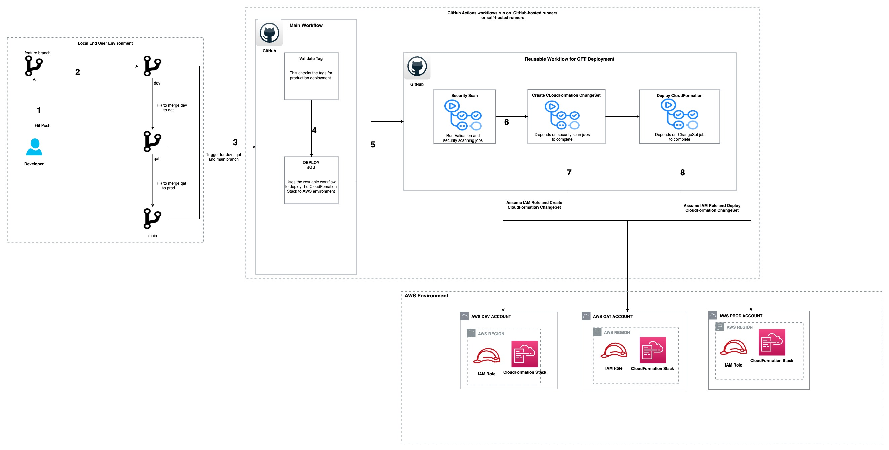

# Multi-Account-AWS-CFN-Deployment-with-GHA-Reusable-Workflow

A GitHub Actions reusable workflow for deploying AWS CloudFormation templates across multiple environments (development, test, production) with automated security scanning and change management.

## Features

- **Multi-Environment Support**: Automated deployment to development, test, and production environments
- **Security Scanning**: Integrated cfn-lint and cfn-nag security validation
- **Change Management**: CloudFormation change sets for safe deployments
- **OIDC Authentication**: Secure AWS authentication using GitHub OIDC
- **Environment-Specific Parameters**: Separate parameter files for each environment

## Repository Structure

```
├── .github/workflows/
│   ├── cft-reuseable-workflow.yml    # Reusable workflow template
│   └── main-workflow.yml             # S3 deployment workflow
├── cloudformation/
│   └── s3.yml                        # S3 bucket CloudFormation template
└── parameters/
    ├── development.json              # Development environment parameters
    ├── test.json                     # Test environment parameters
    ├── production.json               # Production environment parameters
    └── tags.json                     # Common resource tags
```

## Architecture Diagram



## GitHub Actions Pipeline Flow

The pipeline follows a comprehensive CI/CD approach with security scanning, change management, and multi-environment deployment. Here's the detailed step-by-step flow:

### 1. Trigger Events

The pipeline is triggered by:

- **Development Environment**: Push to `development` branch
- **Test Environment**: Push to `test` branch
- **Production Environment**: Git tags matching `v1.*` pattern (must originate from `main` branch)
- **Manual Trigger**: `workflow_dispatch` event

### 2. Environment Detection

The pipeline automatically determines the target environment based on:

```yaml
ENV_NAME: ${{ github.ref_type == 'tag' && 'production' || github.ref_name == 'development' && 'development' || github.ref_name == 'test' && 'test' || 'development' }}
```

### 3. Production Tag Validation (Production Only)

For production deployments:

- **Step 3.1**: Checkout repository with full git history
- **Step 3.2**: Verify the tag was created from the `main` branch
- **Step 3.3**: Compare tag commit with main branch commit
- **Step 3.4**: Fail deployment if tag is not from main branch

### 4. Security Scanning Phase

Before any deployment, comprehensive security validation is performed:

#### 4.1 CloudFormation Linting (cfn-lint)

- Install cfn-lint tool
- Scan CloudFormation template for syntax errors and best practices
- Validate template structure and resource configurations
- Fail pipeline if linting errors are found

#### 4.2 Security Vulnerability Scanning (cfn-nag)

- Run cfn-nag security scanner on CloudFormation template
- Use environment-specific parameter files for context-aware scanning
- Check for security vulnerabilities and misconfigurations
- Generate security scan report

#### 4.3 Security Scan Verification

- Parse cfn-nag output for failure count
- Exit pipeline if any security failures are detected
- Ensure zero security vulnerabilities before proceeding

### 5. Change Set Creation Phase

Safe deployment preparation using CloudFormation change sets:

#### 5.1 AWS Authentication

- Configure AWS credentials using GitHub OIDC
- Assume environment-specific IAM deployment role:
  - Development: `DEVELOPMENT_DEPLOYMENT_ROLE`
  - Test: `TEST_DEPLOYMENT_ROLE`
  - Production: `PRODUCTION_DEPLOYMENT_ROLE`

#### 5.2 CloudFormation Change Set Generation

- Create CloudFormation change set without execution
- Use environment-specific parameters from `parameters/{environment}.json`
- Apply common tags from `parameters/tags.json`
- Generate stack name: `{environment}-blog-{stack_identifier}`

#### 5.3 Change Detection

- Check if changes exist in the change set
- Skip deployment if "No changes to deploy" is detected
- Capture change set ID for later execution

#### 5.4 Change Set Review

- Display detailed change set information in workflow logs
- Show what resources will be created, updated, or deleted
- Provide change impact analysis for review

### 6. CloudFormation Deployment Phase

Execute the validated and reviewed changes:

#### 6.1 Change Set Execution

- Execute the previously created change set
- Deploy infrastructure changes to AWS
- Monitor deployment progress

#### 6.2 Deployment Status Monitoring

- Implement robust status checking with timeout handling
- Monitor stack status every 20 seconds for up to 20 attempts (6.7 minutes)
- Handle all CloudFormation stack states:
  - **Success States**: `CREATE_COMPLETE`, `UPDATE_COMPLETE`
  - **In-Progress States**: `CREATE_IN_PROGRESS`, `UPDATE_IN_PROGRESS`
  - **Rollback States**: `ROLLBACK_IN_PROGRESS`, `UPDATE_ROLLBACK_IN_PROGRESS`
  - **Failure States**: `CREATE_FAILED`, `ROLLBACK_FAILED`, `DELETE_FAILED`

#### 6.3 Deployment Verification

- Verify successful stack deployment
- Confirm all resources are created/updated correctly
- Exit with appropriate status code

### 7. Infrastructure Components Deployed

Deployed a sample CloudFormation template to demonstrate the end-to-end workflow:

#### 7.1 S3 Buckets

- **Primary S3 Bucket**
- **Logging S3 Bucket**

### 8. Environment-Specific Configurations

Each environment uses dedicated parameter files:

- **Development**: `parameters/development.json`
- **Test**: `parameters/test.json`
- **Production**: `parameters/production.json`
- **Common Tags**: `parameters/tags.json`

### 9. Security and Compliance Features

- **OIDC Authentication**: Secure GitHub to AWS authentication without long-lived credentials
- **Least Privilege**: Environment-specific IAM roles with minimal required permissions
- **Change Management**: All changes reviewed via change sets before execution
- **Security Scanning**: Automated vulnerability detection before deployment
- **Audit Trail**: Complete deployment history and change tracking

### 10. Error Handling and Rollback

- Automatic rollback on deployment failures
- Comprehensive error reporting in workflow logs
- Timeout handling for long-running operations
- Status verification with multiple retry attempts

## Usage

### Using the Reusable Workflow

```yaml
jobs:
  deploy:
    uses: ./.github/workflows/cft-reuseable-workflow.yml
    with:
      stack_identifier: your-stack-name
      template_path: path/to/template.yml
      capabilities: CAPABILITY_NAMED_IAM
    secrets: inherit
```

### Required GitHub Secrets

- `AWS_REGION`: AWS region for deployment
- `DEVELOPMENT_DEPLOYMENT_ROLE`: IAM role ARN for development environment
- `TEST_DEPLOYMENT_ROLE`: IAM role ARN for test environment
- `PRODUCTION_DEPLOYMENT_ROLE`: IAM role ARN for production environment

### Environment Mapping

- **Development**: Triggered by pushes to `development` branch
- **Test**: Triggered by pushes to `test` branch
- **Production**: Triggered by tags matching `v1.*` pattern (must be from main branch)

## Deployment Process

1. **Security Scans**: Templates validated with cfn-lint and cfn-nag
2. **Change Set Creation**: CloudFormation change set generated
3. **Change Set Review**: Changes displayed in workflow logs
4. **Deployment**: Change set executed with status monitoring
5. **Verification**: Stack deployment status verified with timeout handling

## Authors

- Deepak Sahu and Sangam Kushwaha

## Security

See [CONTRIBUTING](CONTRIBUTING.md#security-issue-notifications) for more information.

## License

This library is licensed under the MIT-0 License. See the LICENSE file.
